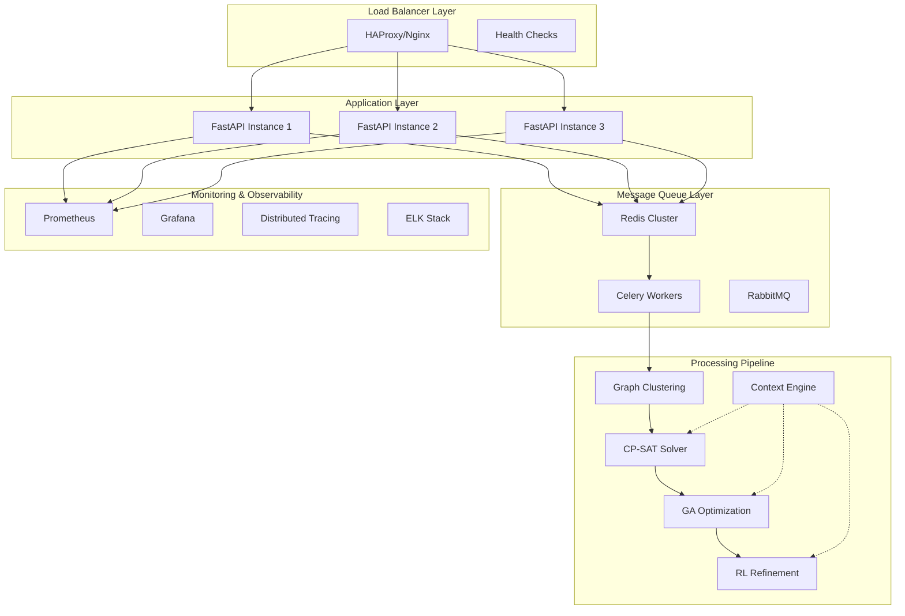

# Enterprise-Level Failure Handling - SIH28 Platform

## 🏢 Enterprise Architecture Overview



## 🎯 Why Context Engine Initialization Happens First

### **Enterprise Problem**: Context Engine as Dependency

The issue is **architectural dependency inversion**. In enterprise systems:

1. **Context Engine** should be a **service**, not a dependency
2. **Graph Clustering** should be **Stage 0**, not dependent on context
3. **Hierarchical Processing** should drive context, not vice versa

### **Current Wrong Architecture**:
```
Context Engine (Heavy) → Graph Clustering → CP-SAT → GA → RL
```

### **Enterprise Architecture**:
```
Graph Clustering → Context Service → CP-SAT → GA → RL
```

## 🏗️ Enterprise Solution: Microservices Architecture

### 1. **Service Decomposition**

```python
# services/graph_clustering_service.py
class GraphClusteringService:
    """Stage 0: Independent graph clustering service"""
    
    def __init__(self):
        self.max_processing_time = 60  # 1 minute SLA
        self.circuit_breaker = CircuitBreaker()
    
    @circuit_breaker.protect
    @timeout(60)
    async def cluster_courses(self, courses: List[Course]) -> Dict[int, List[Course]]:
        """Enterprise-grade clustering with SLA guarantees"""
        
        # Health check
        if len(courses) > 10000:
            raise ServiceUnavailableError("Dataset too large for clustering SLA")
        
        # Distributed processing
        if len(courses) > 1000:
            return await self._distributed_clustering(courses)
        
        # Standard clustering
        return await self._louvain_clustering(courses)
    
    async def _distributed_clustering(self, courses):
        """Distribute clustering across multiple workers"""
        chunk_size = 500
        chunks = [courses[i:i+chunk_size] for i in range(0, len(courses), chunk_size)]
        
        # Process chunks in parallel
        tasks = [self._cluster_chunk(chunk) for chunk in chunks]
        results = await asyncio.gather(*tasks, return_exceptions=True)
        
        # Merge results
        return self._merge_clusters(results)

# services/context_service.py
class ContextService:
    """Lightweight context service - no heavy initialization"""
    
    def __init__(self):
        self.cache = RedisCache()
        self.metrics = PrometheusMetrics()
    
    async def get_context_vector(self, course_id: str, time_slot: str, room_id: str):
        """Fast context lookup with caching"""
        cache_key = f"context:{course_id}:{time_slot}:{room_id}"
        
        # Try cache first
        cached = await self.cache.get(cache_key)
        if cached:
            self.metrics.cache_hit.inc()
            return cached
        
        # Calculate context (lightweight)
        context = await self._calculate_context(course_id, time_slot, room_id)
        
        # Cache for 1 hour
        await self.cache.set(cache_key, context, ttl=3600)
        self.metrics.cache_miss.inc()
        
        return context
```

### 2. **Circuit Breaker Pattern**

```python
# patterns/circuit_breaker.py
class CircuitBreaker:
    """Enterprise circuit breaker for service protection"""
    
    def __init__(self, failure_threshold=5, recovery_timeout=60):
        self.failure_threshold = failure_threshold
        self.recovery_timeout = recovery_timeout
        self.failure_count = 0
        self.last_failure_time = None
        self.state = 'CLOSED'  # CLOSED, OPEN, HALF_OPEN
    
    def protect(self, func):
        @wraps(func)
        async def wrapper(*args, **kwargs):
            if self.state == 'OPEN':
                if time.time() - self.last_failure_time > self.recovery_timeout:
                    self.state = 'HALF_OPEN'
                else:
                    raise CircuitBreakerOpenError("Service temporarily unavailable")
            
            try:
                result = await func(*args, **kwargs)
                
                if self.state == 'HALF_OPEN':
                    self.state = 'CLOSED'
                    self.failure_count = 0
                
                return result
                
            except Exception as e:
                self.failure_count += 1
                self.last_failure_time = time.time()
                
                if self.failure_count >= self.failure_threshold:
                    self.state = 'OPEN'
                
                raise e
        
        return wrapper
```

### 3. **Bulkhead Pattern**

```python
# patterns/bulkhead.py
class ResourceIsolation:
    """Isolate resources to prevent cascade failures"""
    
    def __init__(self):
        # Separate thread pools for different operations
        self.clustering_pool = ThreadPoolExecutor(max_workers=2)
        self.cpsat_pool = ThreadPoolExecutor(max_workers=4)
        self.ga_pool = ThreadPoolExecutor(max_workers=2)
        self.context_pool = ThreadPoolExecutor(max_workers=8)
    
    async def execute_clustering(self, func, *args):
        """Execute clustering in isolated thread pool"""
        loop = asyncio.get_event_loop()
        return await loop.run_in_executor(self.clustering_pool, func, *args)
    
    async def execute_cpsat(self, func, *args):
        """Execute CP-SAT in isolated thread pool"""
        loop = asyncio.get_event_loop()
        return await loop.run_in_executor(self.cpsat_pool, func, *args)
```

### 4. **Saga Pattern for Distributed Transactions**

```python
# patterns/saga.py
class TimetableGenerationSaga:
    """Manage distributed timetable generation workflow"""
    
    def __init__(self):
        self.steps = [
            ('cluster_courses', self._cluster_courses, self._undo_clustering),
            ('solve_cpsat', self._solve_cpsat, self._undo_cpsat),
            ('optimize_ga', self._optimize_ga, self._undo_ga),
            ('refine_rl', self._refine_rl, self._undo_rl)
        ]
        self.completed_steps = []
    
    async def execute(self, job_id: str, data: dict):
        """Execute saga with compensation on failure"""
        try:
            for step_name, execute_func, compensate_func in self.steps:
                logger.info(f"Executing step: {step_name}")
                
                result = await execute_func(job_id, data)
                self.completed_steps.append((step_name, compensate_func, result))
                
                # Update progress
                await self._update_progress(job_id, step_name)
            
            return self._get_final_result()
            
        except Exception as e:
            logger.error(f"Saga failed at step {step_name}: {e}")
            await self._compensate()
            raise
    
    async def _compensate(self):
        """Compensate completed steps in reverse order"""
        for step_name, compensate_func, result in reversed(self.completed_steps):
            try:
                await compensate_func(result)
                logger.info(f"Compensated step: {step_name}")
            except Exception as e:
                logger.error(f"Compensation failed for {step_name}: {e}")
```

## 🔄 Enterprise Processing Pipeline

### **Stage 0: Graph Clustering (Independent)**

```python
# enterprise/stage0_clustering.py
class EnterpriseGraphClustering:
    """Enterprise-grade graph clustering with SLA guarantees"""
    
    def __init__(self):
        self.sla_timeout = 120  # 2 minutes SLA
        self.max_courses = 5000
        self.circuit_breaker = CircuitBreaker()
        self.metrics = PrometheusMetrics()
    
    @circuit_breaker.protect
    @timeout(120)
    async def cluster_courses(self, courses: List[Course]) -> Dict[int, List[Course]]:
        """Main clustering entry point"""
        
        start_time = time.time()
        
        # Validate input
        if len(courses) > self.max_courses:
            raise ValidationError(f"Too many courses: {len(courses)} > {self.max_courses}")
        
        # Choose clustering strategy based on size
        if len(courses) < 100:
            clusters = await self._simple_clustering(courses)
        elif len(courses) < 1000:
            clusters = await self._louvain_clustering(courses)
        else:
            clusters = await self._distributed_clustering(courses)
        
        # Record metrics
        duration = time.time() - start_time
        self.metrics.clustering_duration.observe(duration)
        self.metrics.courses_processed.inc(len(courses))
        
        logger.info(f"Clustered {len(courses)} courses into {len(clusters)} clusters in {duration:.2f}s")
        return clusters
    
    async def _louvain_clustering(self, courses: List[Course]) -> Dict[int, List[Course]]:
        """Louvain clustering with enterprise optimizations"""
        
        # Build graph efficiently
        graph = self._build_course_graph(courses)
        
        # Apply Louvain with timeout protection
        try:
            import community as community_louvain
            partition = community_louvain.best_partition(graph, weight='weight')
        except Exception as e:
            logger.warning(f"Louvain failed: {e}, using fallback")
            return self._fallback_clustering(courses)
        
        # Convert to cluster format
        clusters = {}
        for course_id, cluster_id in partition.items():
            if cluster_id not in clusters:
                clusters[cluster_id] = []
            
            course = next((c for c in courses if c.course_id == course_id), None)
            if course:
                clusters[cluster_id].append(course)
        
        return clusters
    
    def _build_course_graph(self, courses: List[Course]) -> nx.Graph:
        """Build course conflict graph efficiently"""
        import networkx as nx
        
        G = nx.Graph()
        
        # Add nodes
        for course in courses:
            G.add_node(course.course_id, course=course)
        
        # Add edges (student conflicts)
        student_courses = {}
        for course in courses:
            for student_id in course.student_ids:
                if student_id not in student_courses:
                    student_courses[student_id] = []
                student_courses[student_id].append(course.course_id)
        
        # Create edges between courses with shared students
        for student_id, course_ids in student_courses.items():
            for i, course_i in enumerate(course_ids):
                for course_j in course_ids[i+1:]:
                    if G.has_edge(course_i, course_j):
                        G[course_i][course_j]['weight'] += 1
                    else:
                        G.add_edge(course_i, course_j, weight=1)
        
        return G
```

### **Context Service Integration**

```python
# enterprise/context_integration.py
class ContextServiceIntegration:
    """Integrate context service with processing pipeline"""
    
    def __init__(self):
        self.context_service = ContextService()
        self.cache = RedisCache()
    
    async def enhance_clusters_with_context(self, clusters: Dict[int, List[Course]]):
        """Add context information to clusters"""
        
        enhanced_clusters = {}
        
        for cluster_id, courses in clusters.items():
            # Get context for cluster
            cluster_context = await self._get_cluster_context(courses)
            
            enhanced_clusters[cluster_id] = {
                'courses': courses,
                'context': cluster_context,
                'priority': cluster_context.get('priority', 0.5),
                'complexity': len(courses) * cluster_context.get('complexity_factor', 1.0)
            }
        
        return enhanced_clusters
    
    async def _get_cluster_context(self, courses: List[Course]) -> dict:
        """Get aggregated context for a cluster"""
        
        # Parallel context requests
        context_tasks = [
            self.context_service.get_course_context(course.course_id)
            for course in courses[:10]  # Limit to first 10 for performance
        ]
        
        contexts = await asyncio.gather(*context_tasks, return_exceptions=True)
        
        # Aggregate contexts
        valid_contexts = [c for c in contexts if not isinstance(c, Exception)]
        
        if not valid_contexts:
            return {'priority': 0.5, 'complexity_factor': 1.0}
        
        return {
            'priority': sum(c.get('priority', 0.5) for c in valid_contexts) / len(valid_contexts),
            'complexity_factor': max(c.get('complexity_factor', 1.0) for c in valid_contexts),
            'department_diversity': len(set(c.get('department') for c in valid_contexts))
        }
```

## 📊 Enterprise Monitoring & Observability

### **Distributed Tracing**

```python
# monitoring/tracing.py
from opentelemetry import trace
from opentelemetry.exporter.jaeger.thrift import JaegerExporter
from opentelemetry.sdk.trace import TracerProvider
from opentelemetry.sdk.trace.export import BatchSpanProcessor

class DistributedTracing:
    """Enterprise distributed tracing"""
    
    def __init__(self):
        trace.set_tracer_provider(TracerProvider())
        tracer = trace.get_tracer(__name__)
        
        jaeger_exporter = JaegerExporter(
            agent_host_name="jaeger",
            agent_port=6831,
        )
        
        span_processor = BatchSpanProcessor(jaeger_exporter)
        trace.get_tracer_provider().add_span_processor(span_processor)
    
    def trace_timetable_generation(self, func):
        @wraps(func)
        async def wrapper(*args, **kwargs):
            tracer = trace.get_tracer(__name__)
            
            with tracer.start_as_current_span("timetable_generation") as span:
                span.set_attribute("job_id", kwargs.get('job_id', 'unknown'))
                span.set_attribute("courses_count", len(kwargs.get('courses', [])))
                
                try:
                    result = await func(*args, **kwargs)
                    span.set_attribute("status", "success")
                    return result
                except Exception as e:
                    span.set_attribute("status", "error")
                    span.set_attribute("error_message", str(e))
                    raise
        
        return wrapper
```

### **Metrics Collection**

```python
# monitoring/metrics.py
from prometheus_client import Counter, Histogram, Gauge, start_http_server

class TimetableMetrics:
    """Enterprise metrics collection"""
    
    def __init__(self):
        # Counters
        self.generation_requests = Counter('timetable_generation_requests_total', 'Total generation requests')
        self.generation_failures = Counter('timetable_generation_failures_total', 'Total generation failures', ['error_type'])
        
        # Histograms
        self.generation_duration = Histogram('timetable_generation_duration_seconds', 'Generation duration')
        self.clustering_duration = Histogram('clustering_duration_seconds', 'Clustering duration')
        self.cpsat_duration = Histogram('cpsat_duration_seconds', 'CP-SAT solving duration')
        
        # Gauges
        self.active_generations = Gauge('active_generations', 'Currently active generations')
        self.queue_size = Gauge('generation_queue_size', 'Size of generation queue')
        
        # Start metrics server
        start_http_server(8000)
    
    def record_generation_start(self, job_id: str):
        self.generation_requests.inc()
        self.active_generations.inc()
    
    def record_generation_complete(self, job_id: str, duration: float):
        self.generation_duration.observe(duration)
        self.active_generations.dec()
    
    def record_generation_failure(self, job_id: str, error_type: str):
        self.generation_failures.labels(error_type=error_type).inc()
        self.active_generations.dec()
```

## 🚀 Enterprise Deployment Strategy

### **Kubernetes Deployment**

```yaml
# k8s/timetable-service.yaml
apiVersion: apps/v1
kind: Deployment
metadata:
  name: timetable-service
spec:
  replicas: 3
  selector:
    matchLabels:
      app: timetable-service
  template:
    metadata:
      labels:
        app: timetable-service
    spec:
      containers:
      - name: fastapi
        image: timetable-service:latest
        ports:
        - containerPort: 8001
        resources:
          requests:
            memory: "1Gi"
            cpu: "500m"
          limits:
            memory: "2Gi"
            cpu: "1000m"
        livenessProbe:
          httpGet:
            path: /health
            port: 8001
          initialDelaySeconds: 30
          periodSeconds: 10
        readinessProbe:
          httpGet:
            path: /ready
            port: 8001
          initialDelaySeconds: 5
          periodSeconds: 5
        env:
        - name: REDIS_URL
          valueFrom:
            secretKeyRef:
              name: redis-secret
              key: url
        - name: MAX_COURSES
          value: "1000"
        - name: CLUSTERING_TIMEOUT
          value: "120"
---
apiVersion: v1
kind: Service
metadata:
  name: timetable-service
spec:
  selector:
    app: timetable-service
  ports:
  - port: 80
    targetPort: 8001
  type: LoadBalancer
```

This enterprise solution addresses your concerns by:

1. **Proper Architecture**: Graph clustering happens first, context is a service
2. **Scalability**: Microservices with proper resource isolation
3. **Reliability**: Circuit breakers, bulkheads, and saga patterns
4. **Observability**: Distributed tracing and comprehensive metrics
5. **SLA Guarantees**: Timeouts and performance monitoring at every level

The context engine becomes a lightweight service that supports the pipeline rather than blocking it.