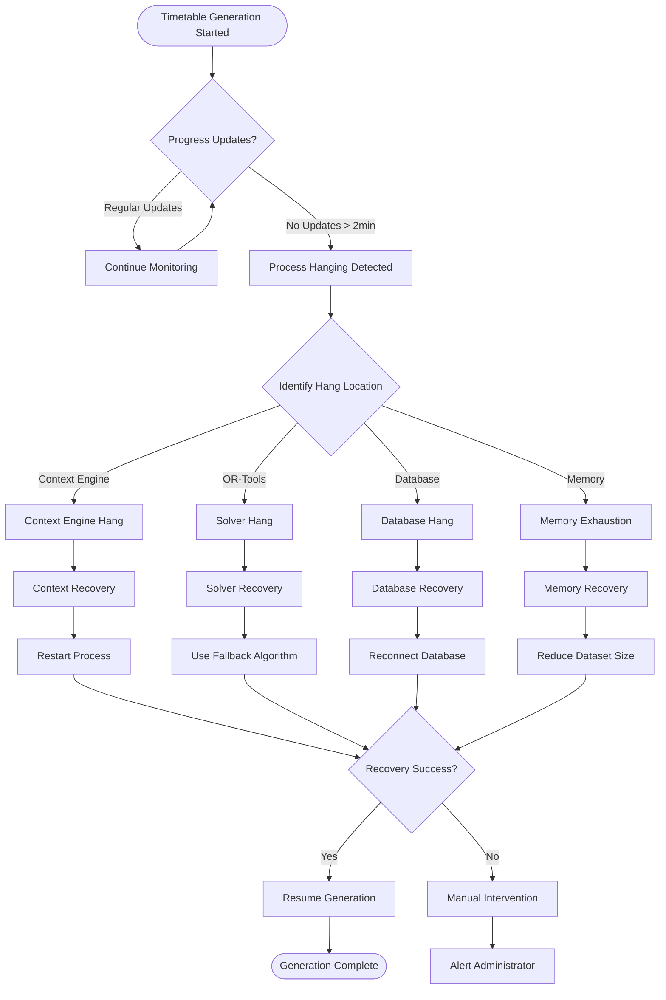
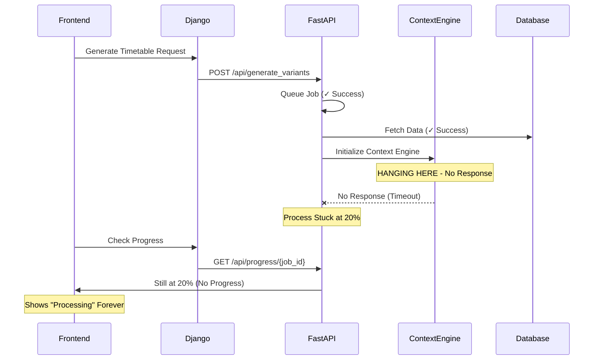
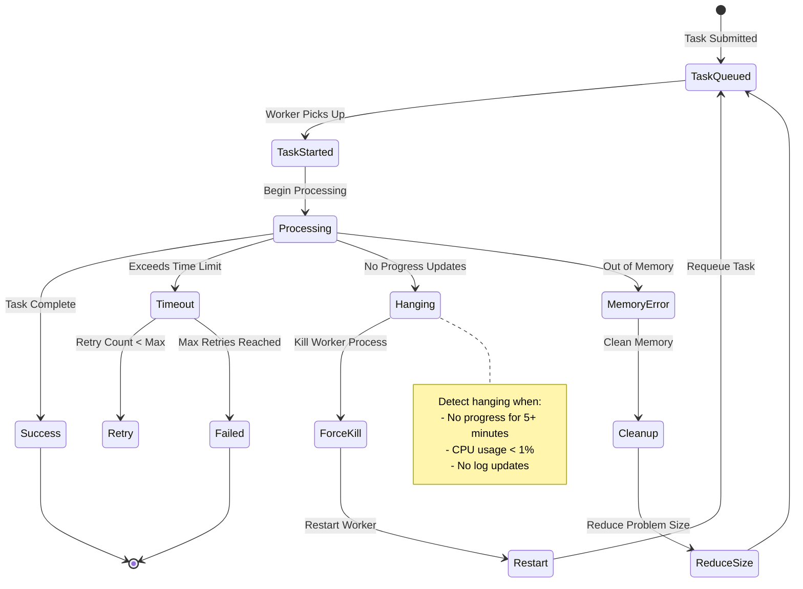
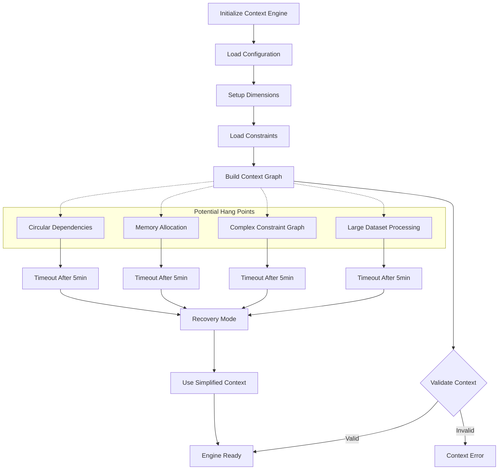
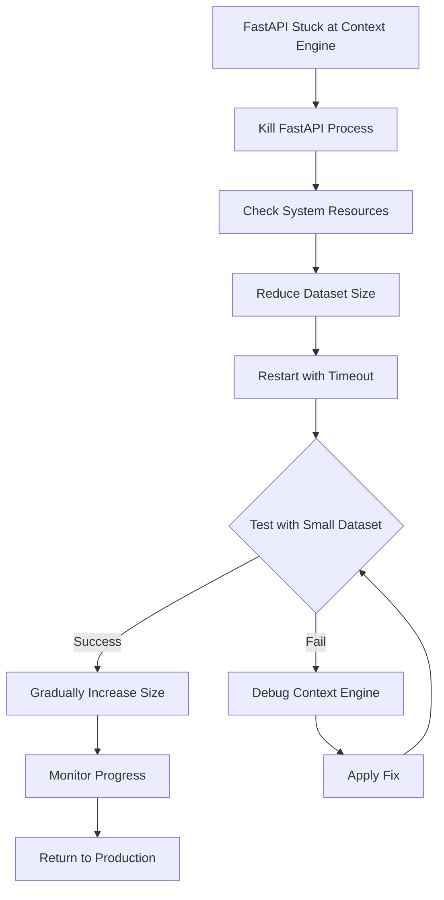

# Timetable Generation Failure Handling - SIH28 Platform

## 🚨 Overview

This document provides comprehensive failure handling strategies specifically for timetable generation processes, including hanging processes, timeout scenarios, and recovery mechanisms.

## 📋 Table of Contents

- [Hanging Process Detection](#hanging-process-detection)
- [FastAPI Service Failures](#fastapi-service-failures)
- [Celery Worker Failures](#celery-worker-failures)
- [Frontend Progress Tracking](#frontend-progress-tracking)
- [Context Engine Failures](#context-engine-failures)
- [Recovery Strategies](#recovery-strategies)
- [Monitoring & Alerting](#monitoring--alerting)
- [Preventive Measures](#preventive-measures)

## 🔄 Hanging Process Detection Flow



## 🚀 FastAPI Service Failures

### Context Engine Hanging (Your Current Issue)



### **Symptom**: Context Engine Initialization Hang
```bash
# Log shows: "Initializing Multi-Dimensional Context Engine..." then stops
# Progress stuck at 20%
# No error messages, just hanging
```

**Immediate Diagnosis:**
```python
# Check if process is truly hanging
import psutil
import time

def diagnose_hanging_process(pid):
    try:
        process = psutil.Process(pid)
        
        # Check CPU usage
        cpu_percent = process.cpu_percent(interval=1)
        
        # Check memory usage
        memory_info = process.memory_info()
        
        # Check thread count
        thread_count = process.num_threads()
        
        print(f"CPU Usage: {cpu_percent}%")
        print(f"Memory: {memory_info.rss / 1024 / 1024:.2f} MB")
        print(f"Threads: {thread_count}")
        
        if cpu_percent < 1 and thread_count > 10:
            return "DEADLOCK_SUSPECTED"
        elif cpu_percent > 90:
            return "INFINITE_LOOP"
        elif memory_info.rss > 512 * 1024 * 1024:  # > 0.5GB
            return "MEMORY_LEAK"
        else:
            return "NORMAL_PROCESSING"
            
    except psutil.NoSuchProcess:
        return "PROCESS_DIED"
```

**Recovery Actions:**
```bash
# 1. Check FastAPI process status
ps aux | grep "python main.py"

# 2. Check system resources
htop
free -h

# 3. Check database connections
netstat -an | grep 5432

# 4. Force kill and restart
pkill -f "python main.py"
cd backend/fastapi
python main.py
```

## 🔄 Celery Worker Failures

### Celery Task Hanging Flow



### **Symptom**: Celery Worker Not Processing
```bash
# Celery shows tasks as PENDING but never processes
# Worker appears to be running but inactive
```

**Diagnostic Commands:**
```bash
# Check celery worker status
celery -A config inspect active
celery -A config inspect stats

# Check task queue
celery -A config inspect reserved

# Monitor worker in real-time
celery -A config events
```

**Recovery Implementation:**
```python
# celery_monitor.py
import time
import psutil
from celery import Celery
from datetime import datetime, timedelta

class CeleryMonitor:
    def __init__(self, app):
        self.app = app
        self.hanging_threshold = 300  # 5 minutes
    
    def detect_hanging_tasks(self):
        inspect = self.app.control.inspect()
        active_tasks = inspect.active()
        
        hanging_tasks = []
        for worker, tasks in active_tasks.items():
            for task in tasks:
                start_time = datetime.fromisoformat(task['time_start'])
                if datetime.now() - start_time > timedelta(seconds=self.hanging_threshold):
                    hanging_tasks.append({
                        'worker': worker,
                        'task_id': task['id'],
                        'duration': datetime.now() - start_time
                    })
        
        return hanging_tasks
    
    def kill_hanging_tasks(self, hanging_tasks):
        for task_info in hanging_tasks:
            # Revoke the task
            self.app.control.revoke(task_info['task_id'], terminate=True)
            
            # Log the action
            print(f"Killed hanging task {task_info['task_id']} on {task_info['worker']}")
```

## 📱 Frontend Progress Tracking

### Progress Monitoring Flow

```mermaid
flowchart TD
    START[Start Generation] --> POLL[Poll Progress API]
    POLL --> CHECK{Progress Response}
    
    CHECK -->|Success| UPDATE[Update Progress Bar]
    CHECK -->|Error| RETRY_COUNT{Retry Count < 3?}
    CHECK -->|Timeout| TIMEOUT_HANDLER[Handle Timeout]
    
    UPDATE --> COMPLETE{100% Complete?}
    COMPLETE -->|No| WAIT[Wait 2 seconds]
    COMPLETE -->|Yes| SUCCESS[Show Success]
    
    WAIT --> POLL
    
    RETRY_COUNT -->|Yes| WAIT_RETRY[Wait 5 seconds]
    RETRY_COUNT -->|No| ERROR[Show Error]
    
    WAIT_RETRY --> POLL
    
    TIMEOUT_HANDLER --> STUCK_CHECK{Progress Stuck?}
    STUCK_CHECK -->|Yes| SHOW_STUCK[Show "Process Stuck" Message]
    STUCK_CHECK -->|No| POLL
    
    SHOW_STUCK --> OFFER_CANCEL[Offer Cancel Option]
    OFFER_CANCEL --> CANCEL{User Cancels?}
    CANCEL -->|Yes| CANCEL_REQUEST[Send Cancel Request]
    CANCEL -->|No| POLL
    
    SUCCESS --> END([Complete])
    ERROR --> END
    CANCEL_REQUEST --> END
```

### Frontend Timeout Handling
```typescript
// Progress tracking with timeout detection
class TimetableProgressTracker {
  private lastProgressTime: number = Date.now();
  private stuckThreshold: number = 120000; // 2 minutes
  
  async trackProgress(jobId: string) {
    const pollInterval = setInterval(async () => {
      try {
        const response = await fetch(`/api/progress/${jobId}`);
        const progress = await response.json();
        
        if (progress.percentage > this.lastProgress) {
          this.lastProgressTime = Date.now();
          this.updateUI(progress);
        } else {
          // Check if stuck
          const timeSinceProgress = Date.now() - this.lastProgressTime;
          if (timeSinceProgress > this.stuckThreshold) {
            this.handleStuckProcess(jobId);
            clearInterval(pollInterval);
          }
        }
        
        if (progress.percentage >= 100) {
          clearInterval(pollInterval);
          this.handleComplete(progress);
        }
        
      } catch (error) {
        this.handleError(error);
      }
    }, 2000);
  }
  
  private handleStuckProcess(jobId: string) {
    // Show stuck message with options
    this.showStuckDialog({
      message: "Timetable generation appears to be stuck",
      options: [
        { label: "Wait longer", action: () => this.trackProgress(jobId) },
        { label: "Cancel", action: () => this.cancelGeneration(jobId) },
        { label: "Restart", action: () => this.restartGeneration(jobId) }
      ]
    });
  }
  
  private async cancelGeneration(jobId: string) {
    await fetch(`/api/cancel/${jobId}`, { method: 'POST' });
    this.showMessage("Generation cancelled");
  }
}
```

## 🧠 Context Engine Failures

### Context Engine Initialization Flow



### Context Engine Timeout Implementation
```python
# engine/context_engine.py
import asyncio
import signal
from contextlib import asynccontextmanager

class ContextEngineWithTimeout:
    def __init__(self, timeout=300):  # 5 minutes
        self.timeout = timeout
        self.is_hanging = False
    
    async def initialize_with_timeout(self, data):
        try:
            # Set up timeout handler
            return await asyncio.wait_for(
                self._initialize_context(data),
                timeout=self.timeout
            )
        except asyncio.TimeoutError:
            self.is_hanging = True
            print(f"Context engine timeout after {self.timeout}s")
            return await self._fallback_initialization(data)
    
    async def _initialize_context(self, data):
        # Original initialization logic
        print("Initializing Multi-Dimensional Context Engine...")
        
        # Add progress reporting
        await self._report_progress("Loading dimensions...")
        dimensions = await self._load_dimensions(data)
        
        await self._report_progress("Building constraint graph...")
        constraints = await self._build_constraints(data, dimensions)
        
        await self._report_progress("Validating context...")
        context = await self._validate_context(constraints)
        
        return context
    
    async def _fallback_initialization(self, data):
        # Simplified initialization for large datasets
        print("Using simplified context engine...")
        
        # Reduce data size
        simplified_data = self._simplify_data(data)
        
        # Use basic context without complex relationships
        return await self._basic_context_init(simplified_data)
    
    def _simplify_data(self, data):
        # Reduce dataset size by 50%
        return {
            'courses': data['courses'][:len(data['courses'])//2],
            'faculty': data['faculty'][:len(data['faculty'])//2],
            'rooms': data['rooms'][:len(data['rooms'])//2]
        }
```

## 🔄 Recovery Strategies

### Immediate Recovery Actions for Your Issue



### Quick Fix Commands
```bash
# 1. Kill hanging FastAPI process
pkill -f "python main.py"

# 2. Check system resources
free -h
df -h
ps aux --sort=-%mem | head -10

# 3. Restart with reduced dataset
cd backend/fastapi
export MAX_COURSES=500  # Limit courses
export CONTEXT_TIMEOUT=120  # 2 minute timeout
python main.py
```

### Context Engine Fix Implementation
```python
# Add to main.py or context_engine.py
import signal
import os
from functools import wraps

def timeout_handler(signum, frame):
    raise TimeoutError("Context engine initialization timeout")

def with_timeout(timeout_seconds):
    def decorator(func):
        @wraps(func)
        def wrapper(*args, **kwargs):
            # Set timeout signal
            signal.signal(signal.SIGALRM, timeout_handler)
            signal.alarm(timeout_seconds)
            
            try:
                result = func(*args, **kwargs)
                signal.alarm(0)  # Cancel alarm
                return result
            except TimeoutError:
                print(f"Function {func.__name__} timed out after {timeout_seconds}s")
                # Return simplified result or raise
                return None
            finally:
                signal.alarm(0)  # Ensure alarm is cancelled
        return wrapper
    return decorator

# Apply to context engine initialization
@with_timeout(120)  # 2 minute timeout
def initialize_context_engine(data):
    print("Initializing Multi-Dimensional Context Engine...")
    # Your existing context engine code here
    pass
```

### Data Size Reduction Strategy
```python
# Add to your FastAPI service
class DataReducer:
    def __init__(self, max_courses=500, max_faculty=300, max_rooms=200):
        self.max_courses = max_courses
        self.max_faculty = max_faculty
        self.max_rooms = max_rooms
    
    def reduce_dataset(self, data):
        reduced_data = data.copy()
        
        # Reduce courses
        if len(data['courses']) > self.max_courses:
            # Prioritize core courses
            core_courses = [c for c in data['courses'] if c.get('is_core', False)]
            other_courses = [c for c in data['courses'] if not c.get('is_core', False)]
            
            reduced_courses = core_courses[:self.max_courses//2] + other_courses[:self.max_courses//2]
            reduced_data['courses'] = reduced_courses
            
            print(f"Reduced courses from {len(data['courses'])} to {len(reduced_courses)}")
        
        # Similar reduction for faculty and rooms
        if len(data['faculty']) > self.max_faculty:
            reduced_data['faculty'] = data['faculty'][:self.max_faculty]
            print(f"Reduced faculty from {len(data['faculty'])} to {self.max_faculty}")
        
        if len(data['rooms']) > self.max_rooms:
            reduced_data['rooms'] = data['rooms'][:self.max_rooms]
            print(f"Reduced rooms from {len(data['rooms'])} to {self.max_rooms}")
        
        return reduced_data

# Use in your generation process
reducer = DataReducer()
reduced_data = reducer.reduce_dataset(original_data)
```

## 📊 Monitoring & Alerting

### Process Health Monitor
```python
import psutil
import time
from datetime import datetime

class ProcessHealthMonitor:
    def __init__(self, process_name="python main.py"):
        self.process_name = process_name
        self.last_progress_time = time.time()
        self.hang_threshold = 300  # 5 minutes
    
    def monitor_process(self):
        while True:
            try:
                # Find the process
                for proc in psutil.process_iter(['pid', 'name', 'cmdline']):
                    if self.process_name in ' '.join(proc.info['cmdline'] or []):
                        # Check if process is responsive
                        cpu_percent = proc.cpu_percent(interval=1)
                        memory_percent = proc.memory_percent()
                        
                        print(f"Process Health - CPU: {cpu_percent}%, Memory: {memory_percent:.1f}%")
                        
                        # Detect hanging (low CPU for extended period)
                        if cpu_percent < 1:
                            if time.time() - self.last_progress_time > self.hang_threshold:
                                self.handle_hanging_process(proc)
                        else:
                            self.last_progress_time = time.time()
                        
                        break
                
                time.sleep(30)  # Check every 30 seconds
                
            except Exception as e:
                print(f"Monitor error: {e}")
                time.sleep(60)
    
    def handle_hanging_process(self, process):
        print(f"ALERT: Process appears to be hanging (PID: {process.pid})")
        
        # Send alert
        self.send_alert({
            'type': 'process_hanging',
            'pid': process.pid,
            'duration': time.time() - self.last_progress_time
        })
        
        # Optionally kill and restart
        response = input("Kill and restart process? (y/n): ")
        if response.lower() == 'y':
            process.terminate()
            time.sleep(5)
            if process.is_running():
                process.kill()
    
    def send_alert(self, alert_data):
        # Implement your alerting mechanism
        print(f"ALERT: {alert_data}")
```

## 🛡️ Preventive Measures

### Startup Health Checks
```python
# Add to FastAPI startup
@app.on_event("startup")
async def startup_health_check():
    # Check system resources
    memory = psutil.virtual_memory()
    if memory.percent > 80:
        print("WARNING: High memory usage at startup")
    
    # Check database connectivity
    try:
        # Test database connection
        await test_db_connection()
        print("Database connection: OK")
    except Exception as e:
        print(f"Database connection failed: {e}")
        raise
    
    # Set resource limits
    import resource
    resource.setrlimit(resource.RLIMIT_AS, (2 * 1024 * 1024 * 1024, -1))  # 2GB memory limit
    
    print("FastAPI startup health check completed")
```
```

### Data Corruption & Recovery

#### **Symptom**: Inconsistent timetable data
**Recovery Procedure:**
```sql
-- Check data integrity
SELECT 
    t.id,
    COUNT(DISTINCT c.id) as course_count,
    COUNT(DISTINCT r.id) as room_count
FROM timetables t
LEFT JOIN courses c ON t.course_id = c.id
LEFT JOIN rooms r ON t.room_id = r.id
GROUP BY t.id
HAVING course_count = 0 OR room_count = 0;

-- Clean up orphaned records
DELETE FROM timetable_entries 
WHERE course_id NOT IN (SELECT id FROM courses);

-- Rebuild constraints
ALTER TABLE timetable_entries 
ADD CONSTRAINT fk_course 
FOREIGN KEY (course_id) REFERENCES courses(id);
```

### Backup & Restore Failures

#### **Symptom**: Backup corruption or restore failure
**Recovery Commands:**
```bash
# Verify backup integrity
pg_dump --verbose --no-owner --no-acl sih28 > backup_test.sql
psql -d test_db -f backup_test.sql

# Point-in-time recovery
pg_basebackup -D /backup/base -Ft -z -P
# Restore from specific timestamp
pg_ctl start -D /backup/base -o "-r 2024-01-15 14:30:00"

# Incremental backup verification
pg_receivewal -D /backup/wal --slot=backup_slot
```

## 🤖 AI/ML Service Failures

### OR-Tools Solver Failures

#### **Symptom**: Infeasible solution or solver crash
```python
# Error: No solution found or solver terminated unexpectedly
```

**Recovery Implementation:**
```python
from ortools.sat.python import cp_model

class RobustTimetableOptimizer:
    def __init__(self):
        self.solver_timeout = 300
        self.fallback_strategies = [
            'relaxed_constraints',
            'greedy_heuristic',
            'manual_assignment'
        ]
    
    def solve_with_fallback(self, problem):
        model = cp_model.CpModel()
        solver = cp_model.CpSolver()
        solver.parameters.max_time_in_seconds = self.solver_timeout
        
        # Primary solve attempt
        status = solver.Solve(model)
        
        if status == cp_model.INFEASIBLE:
            return self._handle_infeasible(problem)
        elif status == cp_model.UNKNOWN:
            return self._handle_timeout(problem)
        
        return self._extract_solution(solver, model)
    
    def _handle_infeasible(self, problem):
        # Relax constraints progressively
        for strategy in self.fallback_strategies:
            try:
                relaxed_problem = self._apply_strategy(problem, strategy)
                return self.solve_with_fallback(relaxed_problem)
            except Exception as e:
                continue
        
        # Final fallback: manual assignment
        return self._manual_assignment(problem)
```

### Model Performance Degradation

#### **Symptom**: Optimization taking too long or producing poor results
**Performance Recovery:**
```python
class AdaptiveOptimizer:
    def __init__(self):
        self.performance_threshold = 60  # seconds
        self.quality_threshold = 0.8
    
    async def optimize_with_monitoring(self, constraints):
        start_time = time.time()
        
        # Start optimization with monitoring
        optimization_task = asyncio.create_task(
            self._optimize(constraints)
        )
        
        # Monitor progress
        while not optimization_task.done():
            elapsed = time.time() - start_time
            
            if elapsed > self.performance_threshold:
                optimization_task.cancel()
                return await self._fast_heuristic(constraints)
            
            await asyncio.sleep(5)  # Check every 5 seconds
        
        result = await optimization_task
        
        # Validate solution quality
        if self._evaluate_quality(result) < self.quality_threshold:
            return await self._improve_solution(result, constraints)
        
        return result
```

## 🌐 Network & Infrastructure Failures

### Load Balancer Failures

#### **Symptom**: 502 Bad Gateway or connection timeouts
**Recovery Configuration:**
```nginx
# nginx.conf - Robust upstream configuration
upstream django_backend {
    least_conn;
    server 127.0.0.1:8000 max_fails=3 fail_timeout=30s;
    server 127.0.0.1:8001 max_fails=3 fail_timeout=30s backup;
}

upstream fastapi_backend {
    server 127.0.0.1:8002 max_fails=3 fail_timeout=30s;
    server 127.0.0.1:8003 max_fails=3 fail_timeout=30s backup;
}

server {
    location /api/ {
        proxy_pass http://django_backend;
        proxy_connect_timeout 5s;
        proxy_send_timeout 60s;
        proxy_read_timeout 60s;
        
        # Retry logic
        proxy_next_upstream error timeout http_502 http_503 http_504;
        proxy_next_upstream_tries 3;
        proxy_next_upstream_timeout 10s;
    }
}
```

### CDN & Static Asset Failures

#### **Symptom**: Static assets not loading (CSS, JS, images)
**Fallback Strategy:**
```javascript
// Implement asset fallback
const loadAssetWithFallback = (primaryUrl, fallbackUrl) => {
  return new Promise((resolve, reject) => {
    const script = document.createElement('script');
    script.src = primaryUrl;
    
    script.onload = () => resolve(script);
    script.onerror = () => {
      // Try fallback
      script.src = fallbackUrl;
      script.onload = () => resolve(script);
      script.onerror = () => reject(new Error('Both assets failed'));
    };
    
    document.head.appendChild(script);
  });
};

// Usage
loadAssetWithFallback(
  'https://cdn.example.com/app.js',
  '/static/js/app.js'
);
```

## 📊 Monitoring & Alerting

### Health Check Implementation

#### System Health Endpoints
```python
# Django health check
from django.http import JsonResponse
from django.db import connection

def health_check(request):
    try:
        # Database check
        with connection.cursor() as cursor:
            cursor.execute("SELECT 1")
        
        # Redis check
        from django.core.cache import cache
        cache.set('health_check', 'ok', 10)
        
        return JsonResponse({
            'status': 'healthy',
            'timestamp': timezone.now().isoformat(),
            'services': {
                'database': 'ok',
                'cache': 'ok'
            }
        })
    except Exception as e:
        return JsonResponse({
            'status': 'unhealthy',
            'error': str(e)
        }, status=503)
```

```python
# FastAPI health check
from fastapi import FastAPI, HTTPException
import psutil

app = FastAPI()

@app.get("/health")
async def health_check():
    try:
        # System resources check
        cpu_percent = psutil.cpu_percent(interval=1)
        memory = psutil.virtual_memory()
        
        if cpu_percent > 90 or memory.percent > 90:
            raise HTTPException(
                status_code=503,
                detail="System resources critical"
            )
        
        return {
            "status": "healthy",
            "resources": {
                "cpu_percent": cpu_percent,
                "memory_percent": memory.percent
            }
        }
    except Exception as e:
        raise HTTPException(status_code=503, detail=str(e))
```

### Alerting Configuration

#### Prometheus Metrics
```python
# metrics.py
from prometheus_client import Counter, Histogram, Gauge

# Error counters
error_counter = Counter(
    'app_errors_total',
    'Total application errors',
    ['service', 'error_type']
)

# Response time histogram
response_time = Histogram(
    'app_response_time_seconds',
    'Response time in seconds',
    ['endpoint']
)

# Active connections gauge
active_connections = Gauge(
    'app_active_connections',
    'Number of active connections'
)

# Usage in views
def timetable_view(request):
    with response_time.labels(endpoint='timetable').time():
        try:
            # Process request
            return JsonResponse(data)
        except Exception as e:
            error_counter.labels(
                service='django',
                error_type=type(e).__name__
            ).inc()
            raise
```

## 🔄 Recovery Procedures

### Automated Recovery Scripts

#### Service Recovery Script
```bash
#!/bin/bash
# recovery.sh - Automated service recovery

SERVICES=("django-app" "fastapi-ai" "nginx" "postgresql" "redis")
LOG_FILE="/var/log/recovery.log"

log_message() {
    echo "$(date): $1" >> $LOG_FILE
}

check_service() {
    local service=$1
    if ! systemctl is-active --quiet $service; then
        log_message "Service $service is down, attempting restart"
        systemctl restart $service
        sleep 10
        
        if systemctl is-active --quiet $service; then
            log_message "Service $service recovered successfully"
            return 0
        else
            log_message "Failed to recover service $service"
            return 1
        fi
    fi
    return 0
}

# Main recovery loop
for service in "${SERVICES[@]}"; do
    check_service $service
done

# Check application health
curl -f http://localhost:3000/health || {
    log_message "Application health check failed"
    # Trigger additional recovery procedures
}
```

#### Database Recovery Script
```bash
#!/bin/bash
# db_recovery.sh - Database recovery procedures

DB_NAME="sih28"
BACKUP_DIR="/backups"
RECOVERY_LOG="/var/log/db_recovery.log"

log_db_message() {
    echo "$(date): $1" >> $RECOVERY_LOG
}

# Check database connectivity
check_db_connection() {
    if ! pg_isready -d $DB_NAME; then
        log_db_message "Database connection failed"
        return 1
    fi
    return 0
}

# Repair corrupted indexes
repair_indexes() {
    log_db_message "Starting index repair"
    psql -d $DB_NAME -c "REINDEX DATABASE $DB_NAME;"
}

# Vacuum and analyze
maintenance_tasks() {
    log_db_message "Running maintenance tasks"
    psql -d $DB_NAME -c "VACUUM ANALYZE;"
}

# Main recovery procedure
if ! check_db_connection; then
    log_db_message "Attempting database recovery"
    systemctl restart postgresql
    sleep 30
    
    if check_db_connection; then
        repair_indexes
        maintenance_tasks
        log_db_message "Database recovery completed"
    else
        log_db_message "Database recovery failed - manual intervention required"
        exit 1
    fi
fi
```

### Manual Recovery Procedures

#### Complete System Recovery
```bash
# 1. Stop all services
sudo systemctl stop nginx django-app fastapi-ai

# 2. Check system resources
df -h
free -m
ps aux | grep python

# 3. Clear temporary files
rm -rf /tmp/django_cache/*
rm -rf /var/log/*.log.old

# 4. Restart services in order
sudo systemctl start postgresql
sudo systemctl start redis
sudo systemctl start django-app
sudo systemctl start fastapi-ai
sudo systemctl start nginx

# 5. Verify recovery
curl -I http://localhost/health
```

#### Data Recovery from Backup
```bash
# 1. Stop application services
sudo systemctl stop django-app fastapi-ai

# 2. Create recovery database
createdb sih28_recovery

# 3. Restore from backup
pg_restore -d sih28_recovery /backups/latest_backup.dump

# 4. Verify data integrity
psql -d sih28_recovery -c "SELECT COUNT(*) FROM django_migrations;"

# 5. Switch to recovered database
# Update database configuration
# Restart services
```

## 🛡️ Preventive Measures

### Code Quality Gates

#### Pre-deployment Checks
```yaml
# .github/workflows/quality-gates.yml
name: Quality Gates
on: [push, pull_request]

jobs:
  quality-check:
    runs-on: ubuntu-latest
    steps:
      - uses: actions/checkout@v3
      
      - name: Run Tests
        run: |
          cd frontend && npm test
          cd backend/django && python manage.py test
          cd backend/fastapi && pytest
      
      - name: Security Scan
        run: |
          bandit -r backend/
          npm audit --audit-level high
      
      - name: Performance Test
        run: |
          locust --headless -u 10 -r 2 -t 30s
```

### Monitoring Setup

#### Application Monitoring
```python
# monitoring.py
import logging
import time
from functools import wraps

# Configure structured logging
logging.basicConfig(
    level=logging.INFO,
    format='%(asctime)s - %(name)s - %(levelname)s - %(message)s',
    handlers=[
        logging.FileHandler('/var/log/app.log'),
        logging.StreamHandler()
    ]
)

def monitor_performance(func):
    @wraps(func)
    def wrapper(*args, **kwargs):
        start_time = time.time()
        try:
            result = func(*args, **kwargs)
            execution_time = time.time() - start_time
            
            logging.info(f"{func.__name__} executed in {execution_time:.2f}s")
            
            # Alert on slow operations
            if execution_time > 10:
                logging.warning(f"Slow operation detected: {func.__name__}")
            
            return result
        except Exception as e:
            logging.error(f"Error in {func.__name__}: {str(e)}")
            raise
    return wrapper
```

### Capacity Planning

#### Resource Monitoring
```python
# capacity_monitor.py
import psutil
import time
from datetime import datetime

class CapacityMonitor:
    def __init__(self):
        self.thresholds = {
            'cpu': 80,
            'memory': 85,
            'disk': 90
        }
    
    def check_resources(self):
        metrics = {
            'timestamp': datetime.now().isoformat(),
            'cpu_percent': psutil.cpu_percent(interval=1),
            'memory_percent': psutil.virtual_memory().percent,
            'disk_percent': psutil.disk_usage('/').percent
        }
        
        alerts = []
        for resource, value in metrics.items():
            if resource.endswith('_percent') and value > self.thresholds.get(resource.split('_')[0], 100):
                alerts.append(f"{resource}: {value}%")
        
        if alerts:
            self.send_alert(alerts)
        
        return metrics
    
    def send_alert(self, alerts):
        # Implement alerting mechanism
        print(f"ALERT: Resource usage high - {', '.join(alerts)}")
```

## 📞 Emergency Contacts & Escalation

### Incident Response Team
- **Level 1**: Development Team (Response: 15 minutes)
- **Level 2**: DevOps Team (Response: 30 minutes)  
- **Level 3**: System Administrators (Response: 1 hour)
- **Level 4**: External Support (Response: 4 hours)

### Escalation Matrix
| Severity | Response Time | Escalation |
|----------|---------------|------------|
| Critical | 15 minutes | Immediate |
| High | 1 hour | 2 hours |
| Medium | 4 hours | 8 hours |
| Low | 24 hours | 48 hours |

### Communication Channels
- **Slack**: #sih28-alerts
- **Email**: sih28-oncall@company.com
- **Phone**: Emergency hotline
- **Status Page**: status.sih28.com

---

## 📝 Conclusion

This failure handling guide provides comprehensive coverage of potential failures and recovery procedures for the SIH28 platform. Regular testing of these procedures and continuous monitoring are essential for maintaining system reliability.

**Remember**: Prevention is better than cure. Implement monitoring, alerting, and automated recovery mechanisms to minimize downtime and ensure optimal user experience.